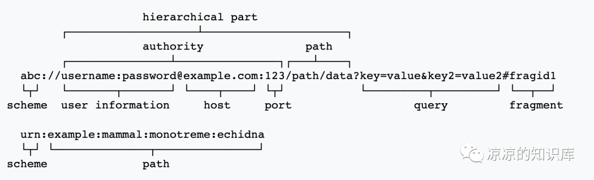
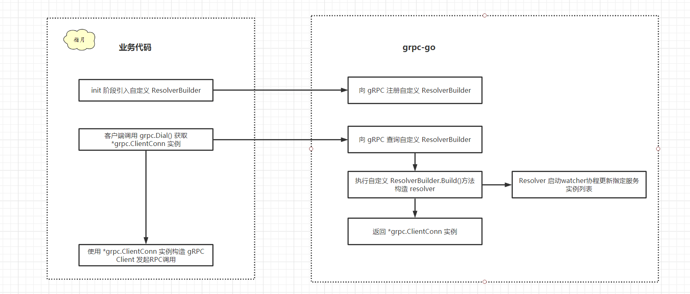

# 服务发现 & 负载均衡

## 基本原理
* 官方文档：https://github.com/grpc/grpc/blob/master/doc/naming.md
* 当服务端有多个实例的时候，就存在2个问题：服务发现和负载均衡
* gRPC中的默认服务发现是使用DNS，同时提供了一些接口，业务实现这些接口就可以自定义服务发现的功能
* // 服务发现遵循RFC 3986，比如服务地址 xxx:///yyyy，则xxx就是Scheme，yyyy实际上是解析后的Path，把它作为service名字来使用
* 负载均衡的算法也提前实现了一些基础的，可以直接选用，最常见的就是RoundRobin

## RFC 3986中定义的URI语法
```
scheme:[//[user[:password]@]host[:port]][/path][?query][#fragment]
```


## 核心概念
* 几个比较抽象的概念，最简单的解释：
* Resolver：是真正负责维护服务端地址列表的，用于将服务名解析成对应实例列表，同步发送给 Balancer
* Builder：是用来生成业务自己的Resolver
* Balancer：平衡器，接收从 Resolver 发送的服务端列表，建立并维护（长）连接状态；每次当 Client 发起 Rpc 调用时，按照一定算法从连接池中选择一个连接进行 Rpc 调用

## Scheme、Builder、Resolver的关系
* 每个 Scheme 对应一个 Builder
* 相同 Scheme 每个不同 target 对应一个 Resolver, 通过 builder.Build 实例化


## 核心接口
gRPC 内置的服务治理功能，开发者在实例化这两个接口之后，就可以实现从指定的 scheme 中获取服务列表，通知 balancer 并与这些服务端建立 RPC 长连接。
* resolver.Builder Builder 用于 gRPC 内部创建 Resolver 接口的实现，但注意内部声明的 Build() 方法将接口 ClientConn 作为参数传入了， ClientConn结库 是非常重要的结构，其成员 conns map[*addrConn]struct{} 中维护了所有从注册中心获取到的服务端列表。
```
// Builder creates a resolver that will be used to watch name resolution updates.
type Builder interface {
    // 创建新的Resolver，需要保存 cc
    // Build creates a new resolver for the given target.
    // gRPC dial calls Build synchronously, and fails if the returned error is not nil.
    Build(target Target, cc ClientConn, opts BuildOption) (Resolver, error)
    
    // 标识解析器，返回字符串，遵循RFC 3986
    // Scheme returns the scheme supported by this resolver.
    // Scheme is defined at https://github.com/grpc/grpc/blob/master/doc/naming.md.
    Scheme() string
}
```

* resolver.Resolver Resolver 提供了 ResolveNow 用于被 gRPC 尝试重新进行服务发现
```
// Resolver watches for the updates on the specified target.
// Updates include address updates and service config updates.
type Resolver interface {
    // 解析目标地址，需要在实现中调用上面 Build 中入参 ClientConn 的 UpdateState 方法更新解析结果。 注意可能存在并发情况
    // ResolveNow will be called by gRPC to try to resolve the target name
    // again. It's just a hint, resolver can ignore this if it's not necessary.
    // It could be called multiple times concurrently.
    ResolveNow(ResolveNowOption)
    
    // Close closes the resolver.
    Close()
}
```




```
1）客户端启动时，注册自定义的 resolver 。
    一般在 init() 方法，构造自定义的 resolveBuilder，并将其注册到 grpc 内部的 resolveBuilder 表中（其实是一个全局 map，key 为协议名，value 为构造的 resolveBuilder）。
2）客户端启动时通过自定义 Dail() 方法构造 grpc.ClientConn 单例
    grpc.DialContext() 方法内部解析 URI，分析协议类型，并从 resolveBuilder 表中查找协议对应的 resolverBuilder。
    找到指定的 resolveBuilder 后，调用 resolveBuilder 的 Build() 方法，构建自定义 resolver，同时开启协程，通过此 resolver 更新被调服务实例列表。
    Dial() 方法接收主调服务名和被调服务名，并根据自定义的协议名，基于这两个参数构造服务的 URI
    Dial() 方法内部使用构造的 URI，调用 grpc.DialContext() 方法对指定服务进行拨号
3）grpc 底层 LB 库对每个实例均创建一个 subConnection，最终根据相应的 LB 策略，选择合适的 subConnection 处理某次 RPC 请求。
```

## 参考文档
https://www.lixueduan.com/posts/grpc/11-name-resolver/
https://blog.csdn.net/daemon365/article/details/139575532
https://blog.csdn.net/qq_41630102/article/details/137782639

https://pandaychen.github.io/2019/11/11/GRPC-RESOLVER-DEEP-ANALYSIS/
https://www.liwenzhou.com/posts/Go/name-resolving-and-load-balancing-in-grpc/
https://blog.cong.moe/post/2021-03-06-grpc-go-discovery-lb/#1-服务端注册
https://segmentfault.com/a/1190000041286666
http://www.baker-yuan.cn/articles/297
https://www.51cto.com/article/759425.html


https://www.cnblogs.com/zhaosc-haha/p/17223702.html


